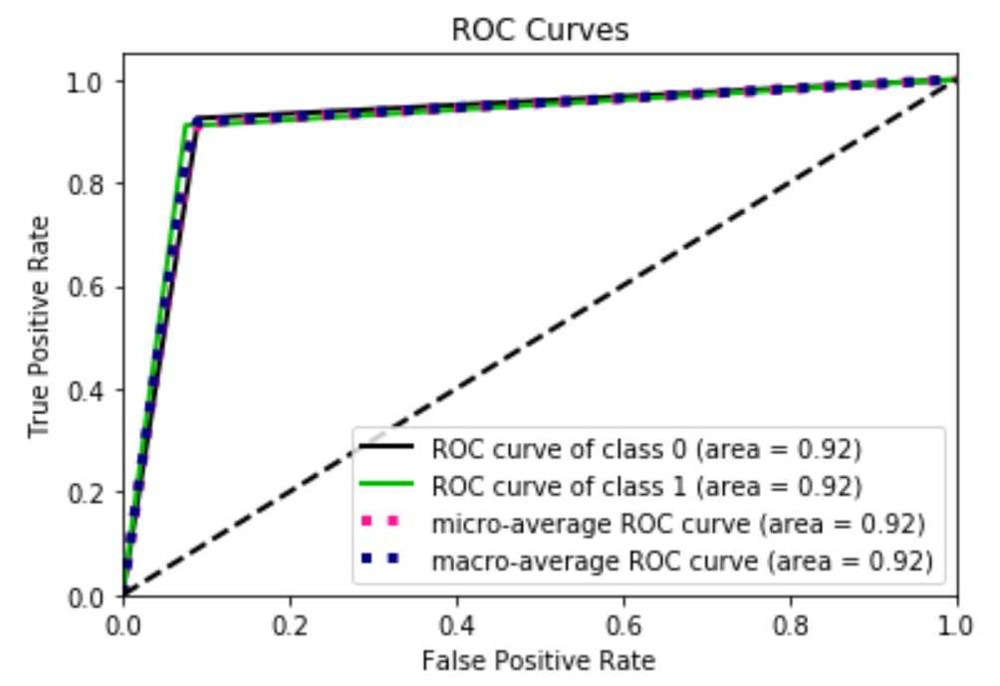
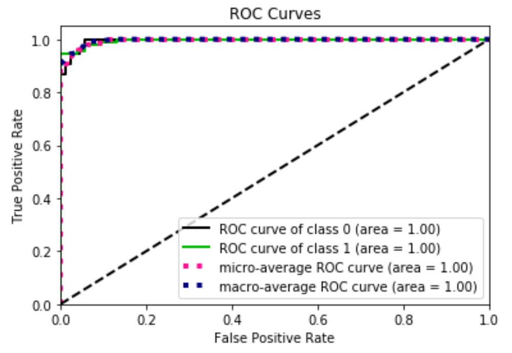
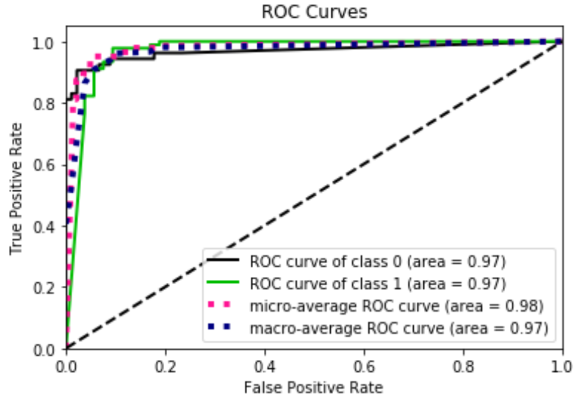
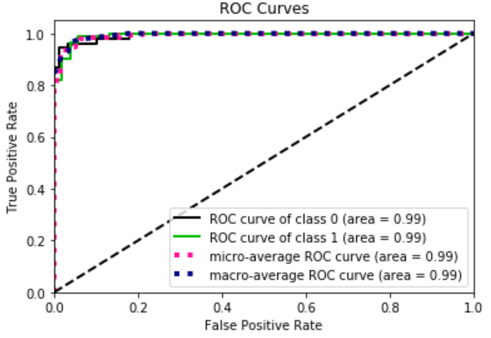
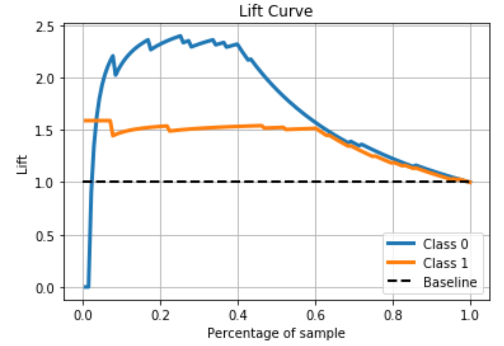
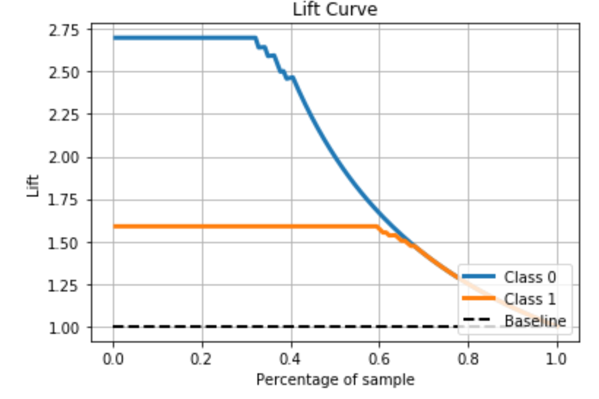
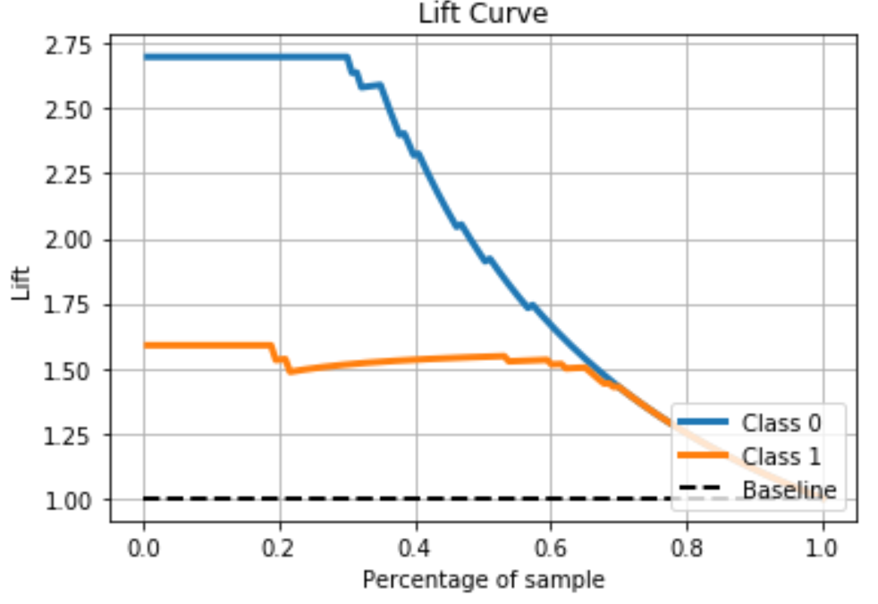
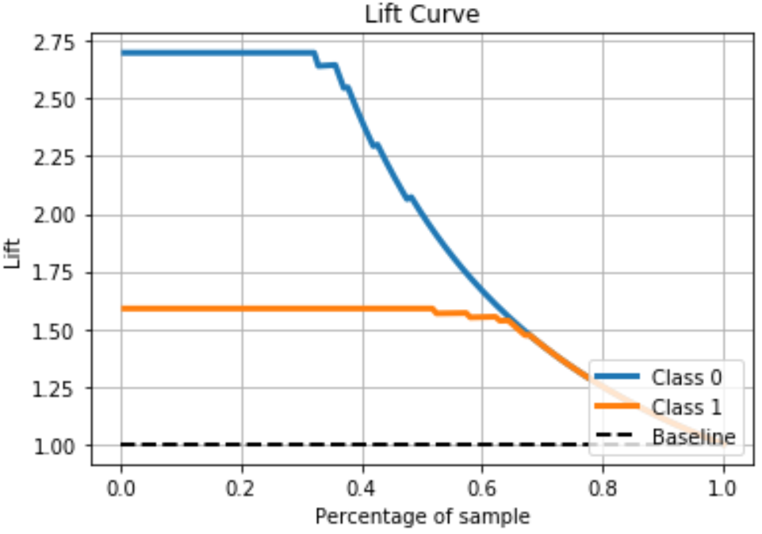

## Breast Cancer Prediction using Predictive Machine Learning techniques

The goal is to predict the occurrence of Malignant form of Breast Cancer using predictive machine learning techniques on UCI Breast Cancer Dataset. Multiple techniques - Decision Tree, Logistic Regression, KNN and SVM are trained and tested through the following steps

- Splitting the data into Train set and Test set. 
  - A stratified sampling of the dataset is done to obtain a training and testing dataset
  - The training data will be used further for modelling the classifiers, where the classifiers will learn from the features of the dataset 
  - The testing data will be held out to test and check model performances in the final stage
- Hyperparameter tuning.
  - The model is tuned for several hyperparameter values using a GridSearch approach to get the values of hyperparameters that gives the best fit.
- Cross Validation.
  - Using the best fit model obtained from the GridSearch tuning, cross-validation is done to validate confidence on model fit
- Training on Train set and testing for model performance on Test set 
  - The models are compared based on several performance measures and finally the model giving the best performance on the testing data is selected

#### Results

During the process, we assume Diagnosis - Malignant as class 0. Since, this is problem statement deals with prediction of cancer, the model's recall takes more importance than accuracy and precision. However, the combination of the different performance measures is considered for selecting the best model

| Description | Decision Tree | Logistic Regression | KNN   | SVM Classifier |
| ----------- | ------------- | ------------------- | ----- | -------------- |
| Accuracy    | 90.9 %        | 95.8 %              | 95.1% | 95.1%          |
| Recall      | 0.91          | 0.91                | 0.91  | 0.89           |
| Precision   | 0.86          | 0.98                | 0.96  | 0.98           |
| F-score     | 0.88          | 0.94                | 0.93  | 0.93           |

*All recall, precision and F-score values mentioned are for Malignant class*

Comparing the four models, we observe that the recall values for all models are maximum except for the SVM classifier. However, Logistic Regression model turns out to be best performer in terms of overall accuracy, precision as well as F-score. Hence, given this data, the Logistic Regression model we have obtained is the best model. 

<u>**ROC curves:**</u>

Also, looking at the ROC curve for each of the classifier, the curve for Logistic regression has the maximum area under the curve of 1, indicating high performance and closely resembles the ideal classifier's curve. The next best ROC performance is exhibited by SVM classifier with Area under the curve of 0.99

1) Decision Tree

2) Logistic Regression

3) KNN Classifier

4) SVM Classifier

**<u>Lift Curve:</u>**

The lift curve gives a measure of how well our model performs compared to a random classifier. With the instances ordered by decreasing predicted probability of belonging to the positive class, lift curve captures the ratio of number of positive instances predicted by the considered model to the number of positive instances as predicted by a random classifier. 

Considering our desired class 0, all the classifiers have a lift of 2.75 till up to 30% of the data and gradually decreases with increasing percentage of data and reaches 1 at 100% of data. 

1) Decision Tree

2) Logistic Regression

3) KNN Classifier

4) SVM Classifier

